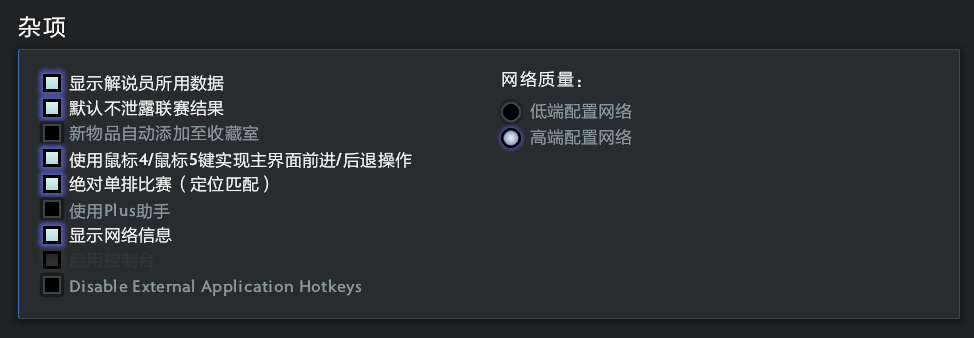
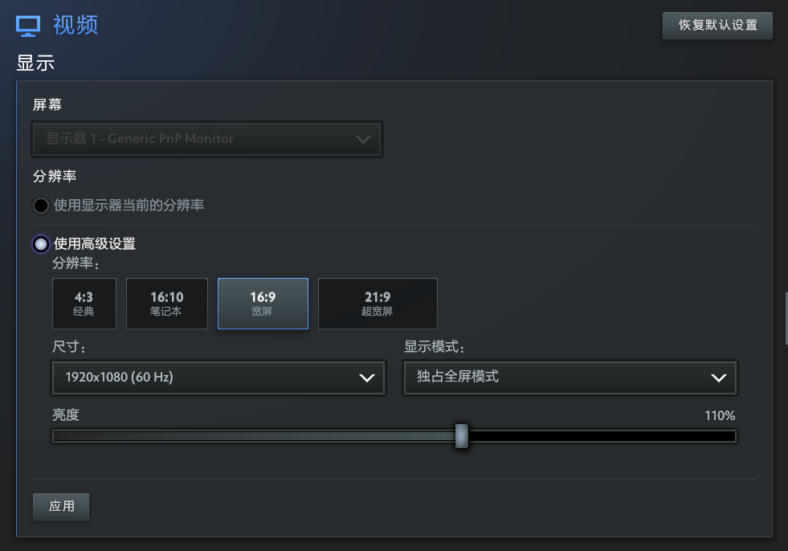
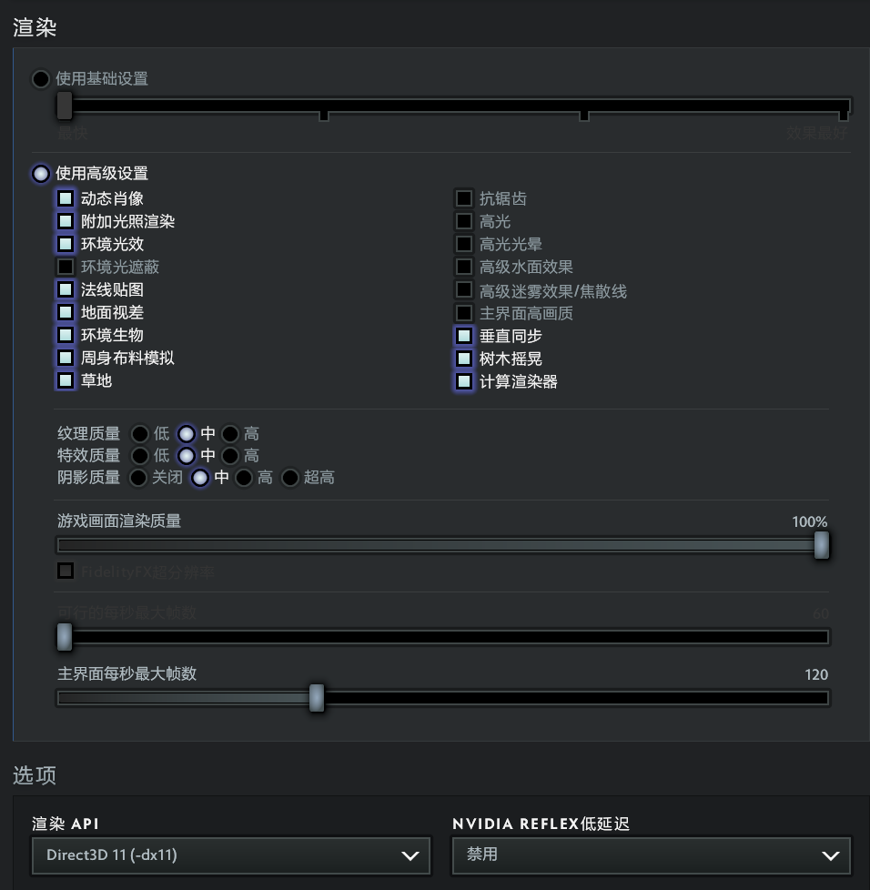

# 启动项优化使用概要(避免限制)

随着启动项命令越来越多期望设置的越来越多时，当最大长度超1024 个字符（含空格）时后面的命令就会不生效，所以需要在Steam中加入必要的命令然后必填一个autoexec.cfg文件。启动游戏会加载配置文件读取里面的所有启动项命令，而auctoexec.cfg注重于个人习惯配置

鼠标PDI: `2000`

国服启动项: `-perfectworld` (国际服不加就行)

## Steam右键游戏属性

### 国服启动

`-perfectworld -console +fps_max 0 -high -map dota -novid -nojoy +exec autoexec.cfg`

### 国际服启动

`-console +fps_max 0 -high -map dota -novid -nojoy +exec autoexec.cfg`

因为这些命令只能在这里生效其中+exec autoexec.cfg是加载更多优化命令

## autoexec.cfg

存放目录：steam右键dota2管理 - 浏览本地文件 - game - dota - cfg

```
//=============================================================================
// DOTA 2 ULTIMATE AUTOEXEC
// Version 2026
// Clean Edition
//=============================================================================

echo ""
echo "=========================================="
echo "      DOTA2 ULTIMATE AUTOEXEC LOADED"
echo "=========================================="
echo ""

echo "############################################################"
echo "#                                                          #"
echo "#      ██████╗  ██████╗ ████████╗ █████╗  ██████╗           #"
echo "#      ██╔══██╗██╔═══██╗╚══██╔══╝██╔══██╗██╔════╝           #"
echo "#      ██║  ██║██║   ██║   ██║   ███████║╚█████╗            #"
echo "#      ██║  ██║██║   ██║   ██║   ██╔══██║ ╚═══██╗           #"
echo "#      ██████╔╝╚██████╔╝   ██║   ██║  ██║██████╔╝           #"
echo "#      ╚═════╝  ╚═════╝    ╚═╝   ╚═╝  ╚═╝╚═════╝            #"
echo "#                                                          #"
echo "############################################################"

//=============================================================================
// Console
//=============================================================================

con_enable "1"

//=============================================================================
// FPS
//=============================================================================

// Unlimited FPS
fps_max "0"

// UI FPS（新版 Source2）
fps_max_ui "120"

// 后台不休眠
engine_no_focus_sleep "0"

//=============================================================================
// Network
//=============================================================================

rate "800000"

//=============================================================================
// Mouse
//=============================================================================

sensitivity "3"

m_pitch "0.022"
m_yaw "0.022"

zoom_sensitivity_ratio "1"

//=============================================================================
// Camera
//=============================================================================

// 鼠标平移 / Edge Pan
// 0 = 关闭
// 1 = 开启
dota_camera_edgemove "1"

// 视角反摇
// 0 = 正常
// 1 = 反转
dota_camera_reverse "0"

// 重生时视角居中到英雄
// 0 = 关闭
// 1 = 开启
dota_reset_camera_on_spawn "0"

// 禁用镜头缩放
// 0 = 允许缩放
// 1 = 禁止缩放
dota_camera_disable_zoom "0"

// 按住“选中英雄”键来跟随
// 0 = 关闭
// 1 = 开启
dota_camera_hold_select_to_follow "1"

// 左键点击激活镜头反摇 / Camera Grip
// 0 = 关闭
// 1 = 开启
dota_leftclick_cameragrip_new "0"

// 启用画面晃动
// 0 = 关闭
// 1 = 开启
dota_screen_shake "1"

// 观战时视角平滑拖曳
// 0 = 关闭
// 1 = 开启
dota_camera_dotatv_smooth_drag "0"

// 鼠标平移时启用观战或临时自由视角
// 0 = 关闭
// 1 = 开启
dota_spectator_enable_edgepan_temporary_free_camera "1"

// 视角速度
dota_camera_speed "2712"

// 视角减速
// 5 = 最低
// 50 = 最高
dota_camera_accelerate "50"

// 自由视角覆盖时间
// 单位：秒
dota_camera_temporary_freecamera_time "2"

//=============================================================================
// Gameplay
//=============================================================================

// 自定义游戏期间禁用分单位快捷键
dota_per_unit_keybindings_disabled_during_custom_games "0"

// 默认按下快捷键时触发快速施法
dota_quickcast_onkeydown "1"

// 使用Dota传统键位
// 0 = 关闭（现代 QWER）
// 1 = 开启（DotA 1 Legacy Keys）
dota_ability_legacy_mode_quick_cast "0"

dota_ability_quick_cast "1"

dota_enable_direct_quickcast_bindings "1"

dota_item_double_tap_self_cast "1"

dota_smart_doubletap "1"

dota_alt_right_range_hint "1"

//=============================================================================
// Player
//=============================================================================

dota_force_right_click_attack "2"          // 右键友军 = 反补
dota_player_units_auto_attack_mode "1"     // 自动攻击 = 标准
dota_summoned_units_auto_attack_mode_2 "2" // 召唤单位 = 始终攻击

dota_player_multipler_orders "1"           // CTRL统一指令
dota_player_smart_multiunit_cast "1"       // 智能多单位施法
dota_selection_groups "0"                  // 智能选择编组 = 关闭

dota_settings_targeted_attack_move "1"     // 智能攻击移动
dota_settings_targeted_attack_move_radius "200"

dota_settings_quick_target_attack "0"     // 快速攻击 = 关闭
dota_settings_quick_move "0"              // 快速移动 = 关闭

cl_dota_alt_unit_movetodirection "0" // ALT 径直移动

dota_ability_self_cast_timeout "0.60" // 双击判定时间

dota_player_add_summoned_to_selection "0" // 自动选择召唤单位

dota_player_teleport_requires_halt "1"
dota_player_channels_require_stop "1"
dota_player_interaction_channels_require_stop "1"

dota_continue_click_movement_after_cast_cancel "1"

dota_disable_autoattack_during_stop "1"

dota_player_auto_repeat_right_mouse "1"

dota_toggle_autoattack_automatically_during_orders "0"

//=============================================================================
// HUD
//=============================================================================

dota_hud_netgraph "1"

dota_hud_queued_orders_enable "1"

dota_hud_healthbar_local_player_high_visibility "1"

dota_show_accept_match_details "1"

//=============================================================================
// Minimap
//=============================================================================

// 普通状态：英雄带箭头
// 0 = 英雄带箭头
// 1 = 仅英雄
// 2 = 箭头（玩家颜色）
// 3 = 箭头（团队颜色）
// 4 = 英雄名
dota_minimap_primary_option "0"

// ALT 状态：英雄名
dota_minimap_secondary_option "4"

// 0 = 无
// 1 = 简易
// 2 = 写实
dota_minimap_background_option "2"

// 0 = 靠左
// 1 = 靠右
dota_minimap_position_option "1"

// 0 = 普通
// 1 = 特大
dota_hud_extra_large_minimap "0"

// 动态调整英雄图标
// 0 = 关闭
// 1 = 开启
dota_minimap_hero_scalar "0"

// 英雄图标大小
// 600  ≈ 100%
// 900  ≈ 150%
// 1200 ≈ 200%
dota_minimap_hero_size "1200"

// 小地图误点判定时间
// 单位：秒
dota_minimap_misclick_time "0.20"

dota_minimap_always_draw_hero_icons "1"

dota_minimap_simple_background "1"

dota_minimap_hide_background "0"

//=============================================================================
// Overlay Map
//=============================================================================

// 按住快捷键时显示，松开隐藏
// 0 = 按住时可见
// 1 = 切换可见性
dota_overlaymap_togglemode "0"

// Overlay Map 不接受鼠标输入
// 0 = 从不
// 1 = 始终
// 2 = 按住快捷键时
dota_overlaymap_inputmode "0"

// 叠加地图透明度
// 0.0 = 0%
// 0.5 = 50%
// 1.0 = 100%
dota_overlaymap_opacity "0.5"

// Overlay Map 居中
// 0 = 居中
// 1 = 靠左
// 2 = 靠右
dota_overlaymap_position "0"

//=============================================================================
// Shop
//=============================================================================

// 总是使用快捷键购买装备
// 0 = 关闭
// 1 = 开启
dota_shop_force_hotkeys "0"

// 商店打开时自动聚焦搜索框
// 0 = 关闭
// 1 = 开启
dota_shop_search_autofocus "0"

// 启用简易版商店
// 0 = 关闭
// 1 = 开启
dota_enable_new_player_shop "0"

//=============================================================================
// Quick Buy / Purchase Marking
//=============================================================================

// 加入快速购买的物品自动标记为预购
// 0 = 关闭
// 1 = 开启
dota_auto_mark_for_buy "1"

// 右键点击秘密商店物品时加入快速购买并标记预购
// 0 = 关闭
// 1 = 开启
dota_shop_mark_for_buy_secret_shop_item "1"

// 右键点击无法购买的快速购买物品时标记预购
// 0 = 关闭
// 1 = 开启
dota_quickbuy_rightclick_marksforbuy "1"

//=============================================================================
// Courier Auto Deliver
//=============================================================================

// 普通模式默认开启自动运送
// 0 = 关闭
// 1 = 开启
dota_courier_autodeliver "1"

// Turbo 默认开启自动运送
// 0 = 关闭
// 1 = 开启
dota_turbo_courier_default_auto_deliver "1"

// 自动运送时，如果速度爆发可用则自动使用
// 0 = 关闭
// 1 = 开启
dota_auto_courier_auto_burst "1"

// 英雄隐身时不自动运送
// 0 = 允许隐身时运送
// 1 = 仅英雄可见时运送
dota_auto_courier_deliver_visible_only "0"

//=============================================================================
// Interface
//=============================================================================

// 施法时显示技能距离
// 0 = 关闭
// 1 = 开启
dota_enable_range_finder "1"

// 死亡后视角颜色改变
// 0 = 关闭
// 1 = 开启
dota_camera_deatheffect "1"

// 隐藏伤害数值
// 0 = 显示
// 1 = 隐藏
dota_hud_disable_damage_numbers "0"

// 单位查询覆盖英雄控制面板
// 0 = 开启
// 1 = 关闭
dota_hud_new_query_panel "0"

// 在游戏界面上显示排队中的指令
// 0 = 关闭
// 1 = 开启
dota_hud_queued_orders_enable "1"

// 色盲模式
// 0 = 关闭
// 1 = 开启
// 2 = 区分队友
dota_hud_colorblind "0"

//=============================================================================
// Cursor
//=============================================================================

// 自动选择指针大小
// 0 = 关闭
// 1 = 开启
cl_auto_cursor_scale "0"

// 指针大小
// 1.0 = 100%
cl_cursor_scale "1"

//=============================================================================
// ALT Information
//=============================================================================

// ALT 显示英雄位置
// 0 = 关闭
// 1 = 开启
dota_show_hero_finder "1"

// ALT 显示野怪刷新范围
// 0 = 关闭
// 1 = 开启
dota_alt_shows_neutral_spawn_boxes "1"

// ALT 显示防御塔攻击范围
// 0 = 关闭
// 1 = 开启
dota_alt_shows_tower_attack_range "1"

//=============================================================================
// Health Bars
//=============================================================================

// 启用高可见度本地英雄血条
// 0 = 关闭
// 1 = 开启
dota_hud_healthbar_local_player_high_visibility "1"

// 区分队友血条
// 0 = 普通
// 1 = 色盲模式
// 2 = 区分队友血条
dota_hud_colorblind "0"

// 血条上显示名称
// 0 = 英雄名称
// 1 = 玩家名称
// 2 = 无
dota_hero_overhead_names "2"

// 禁用状态文字
// 0 = 显示
// 1 = 隐藏
dota_hud_healthbar_disable_status_display "0"

//=============================================================================
// Audio
//=============================================================================

volume "1"

snd_disable_mixer_duck "1"

//=============================================================================
// Misc
//=============================================================================

joystick "0"

//=============================================================================
// Useful Aliases
//=============================================================================

alias dc "disconnect"
alias rc "retry"
alias cls "clear"
alias rs "restart"

alias banner "
echo ========================================
echo DOTA 2 Ultimate Autoexec
echo Version 2026
echo Loaded Successfully
echo ========================================
"

echo "Version 2026.07"
echo "Ultimate Autoexec Loaded"
echo ">>> DOTA 2 AUTOEXEC v2026.07 Loaded <<<"
alias banner "exec banner"
```

## banner.cfg

```
echo ############################################################;
echo #                                                          #;
echo #      ██████╗  ██████╗ ████████╗ █████╗  ██████╗           #;
echo #      ██╔══██╗██╔═══██╗╚══██╔══╝██╔══██╗██╔════╝           #;
echo #      ██║  ██║██║   ██║   ██║   ███████║╚█████╗            #;
echo #      ██║  ██║██║   ██║   ██║   ██╔══██║ ╚═══██╗           #;
echo #      ██████╔╝╚██████╔╝   ██║   ██║  ██║██████╔╝           #;
echo #      ╚═════╝  ╚═════╝    ╚═╝   ╚═╝  ╚═╝╚═════╝            #;
echo #                                                          #;
echo ############################################################;
echo;
echo          Welcome, Calvin Dou;
echo          DOTA 2 Ultimate Autoexec 2026-07  Dota2 YYDS♥;
echo;
echo ############################################################
"

```

# 游戏内设置






