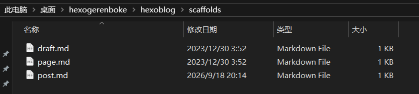
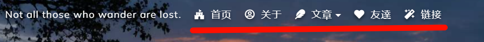
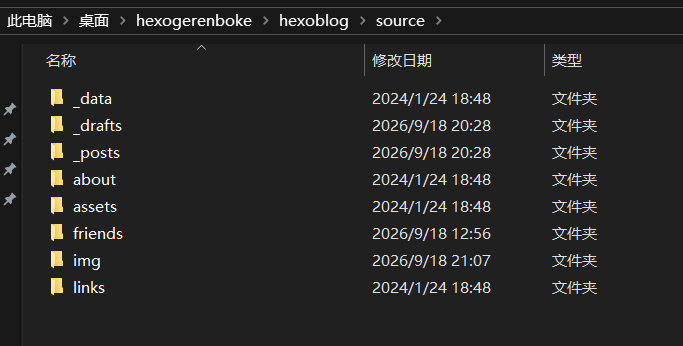

# 介绍

一共有三种模式



说明：

- draft：草稿(不显示到页面)
- page：独立页面
- post：文章

## 创建文章

命令：`hexo new "文章"`

- 如果不指定创建模式那么默认创建_post目录中

命令：`hexo new -p python/python "python"`

- 使用-p来指定目录python/为目录python为文章名称"python"为文章标题

## 文章生成编辑

打开scaffolds目录中的post.md

```
title: {{ title }}
date: {{ date }}
tags:
```

内容可能是这样的，但是缺少了categories:，我们可以在这里加上，以后生成的文章自带categories:，或者是sticky: 是否置顶

```
title: {{ title }}
date: {{ date }}
categories:
tags:
```

## 草稿生成

当我们想要编写一个文章时可以先在草稿中进行编写

命令：`hexo new draft "python基础"`

此时就会在_draft目录生成一个草稿文章

- 可能项目没有自带_draft目录，当我们执行命令后会自动创建或者自己手动创建

当草稿写完了之后可以将草稿通过命令转移到_post文章目录中

命令：`hexo publish "python基础"`

此时python基础这个草稿文章就会从_draft目录被转移到 _post目录中 显示到页面上

## 独立页面生成

什么是独立页面

> 
>
> 页面上的 关于，文章，友链，链接。这些都是独立页面，这些对应下面目录
>
> 
>
> 也就是说当执行命令后会在source目录中添加一个 独立页面的目录里面生成一个index.md文件来当做一个独立的页面，我们可以自由编辑

命令：`hexo new page "about"`

- source目录下虽然存在img存放图片的目录但是它并不是独立页面的目录因为里面没有index.md，只有创建index.md才算独立页面
- 需要在hexogerenboke\hexoblog\themes\shoka\_config.yml中的menu下添加独立页面到博客中 否则不会显示的

```yaml
menu:
  home: / || home
  about: /about/ || user
  posts:
    default: / || feather
    archives: /archives/ || list-alt
    categories: /categories/ || th
    tags: /tags/ || tags
  friends: /friends/ || heart
  links: /links/ || magic
#添加自己创建的独立页面比如：news
  news: /news/ || news
```

