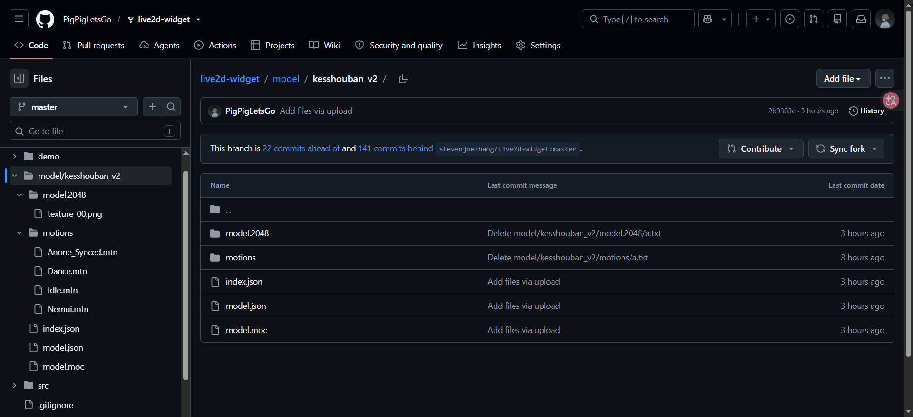
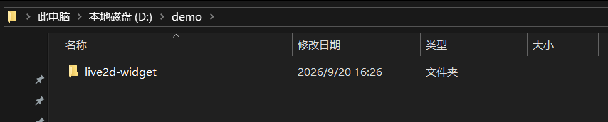
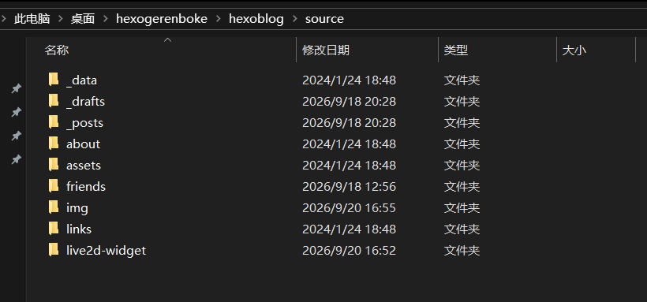

# 配置看板娘

项目地址

 [live2d-widget](https://github.com/stevenjoezhang/live2d-widget) 

## Fork live2d-widget项目

将上面的项目fork一份

## Fork血小板

项目地址

[platelet血小板](https://github.com/PigPigLetsGo/platelet) 

将此项目拉取到本地，然后将kesshouban_v2目录上传至live2d-widget项目根目录下的model目录中。如果没有就创建一个model目录

效果：



## 编辑autoload.js

live2d_path: 将https://fastly.jsdelivr.net/gh/github名称/live2d-widget@仓库/ 修改为自己的

剩下的直接复制即可

```js
// live2d_path 参数建议使用绝对路径
// 原:https://fastly.jsdelivr.net/gh/stevenjoezhang/live2d-widget@latest/
const live2d_path = "https://fastly.jsdelivr.net/gh/PigPigLetsGo/live2d-widget@master/";
//const live2d_path = "/live2d-widget/";

// 封装异步加载资源的方法
function loadExternalResource(url, type) {
	return new Promise((resolve, reject) => {
		let tag;

		if (type === "css") {
			tag = document.createElement("link");
			tag.rel = "stylesheet";
			tag.href = url;
		}
		else if (type === "js") {
			tag = document.createElement("script");
			tag.src = url;
		}
		if (tag) {
			tag.onload = () => resolve(url);
			tag.onerror = () => reject(url);
			document.head.appendChild(tag);
		}
	});
}

// 加载 waifu.css live2d.min.js waifu-tips.js
if (screen.width >= 768) {
	Promise.all([
		loadExternalResource(live2d_path + "waifu.css", "css"),
		loadExternalResource(live2d_path + "live2d.min.js", "js"),
		loadExternalResource(live2d_path + "waifu-tips.js", "js")
	]).then(() => {
		// 配置选项的具体用法见 README.md
		initWidget({
	waifuPath: live2d_path + "waifu-tips.json",
	cdnPath: live2d_path,
	tools: ["asteroids", "photo", "quit"]
});
	});
}

console.log(`
  く__,.ヘヽ.        /  ,ー､ 〉
           ＼ ', !-─‐-i  /  /´
           ／｀ｰ'       L/／｀ヽ､
         /   ／,   /|   ,   ,       ',
       ｲ   / /-‐/  ｉ  L_ ﾊ ヽ!   i
        ﾚ ﾍ 7ｲ｀ﾄ   ﾚ'ｧ-ﾄ､!ハ|   |
          !,/7 '0'     ´0iソ|    |
          |.从"    _     ,,,, / |./    |
          ﾚ'| i＞.､,,__  _,.イ /   .i   |
            ﾚ'| | / k_７_/ﾚ'ヽ,  ﾊ.  |
              | |/i 〈|/   i  ,.ﾍ |  i  |
             .|/ /  ｉ：    ﾍ!    ＼  |
              kヽ>､ﾊ    _,.ﾍ､    /､!
              !'〈//｀Ｔ´', ＼ ｀'7'ｰr'
              ﾚ'ヽL__|___i,___,ンﾚ|ノ
                  ﾄ-,/  |___./
                  'ｰ'    !_,.:
`);
```

## 修改waifu-tips.js

直接复制即可

```js
/*!
 * Live2D Widget
 * https://github.com/stevenjoezhang/live2d-widget
 */
!function(){"use strict";function e(e){return Array.isArray(e)?e[Math.floor(Math.random()*e.length)]:e}let t;function o(o,s,n){if(!o||sessionStorage.getItem("waifu-text")&&sessionStorage.getItem("waifu-text")>n)return;t&&(clearTimeout(t),t=null),o=e(o),sessionStorage.setItem("waifu-text",n);const i=document.getElementById("waifu-tips");i.innerHTML=o,i.classList.add("waifu-tips-active"),t=setTimeout((()=>{sessionStorage.removeItem("waifu-text"),i.classList.remove("waifu-tips-active")}),s)}class s{constructor(e){let{apiPath:t,cdnPath:o}=e,s=!1;if("string"==typeof o)s=!0,o.endsWith("/")||(o+="/");else{if("string"!=typeof t)throw"Invalid initWidget argument!";t.endsWith("/")||(t+="/")}this.useCDN=s,this.apiPath=t,this.cdnPath=o}async loadModelList(){const e=await fetch(`${this.cdnPath}model_list.json`);this.modelList=await e.json()}async loadModel(t,s,n){if(localStorage.setItem("modelId",t),localStorage.setItem("modelTexturesId",s),o(n,4e3,10),this.useCDN){loadlive2d("live2d",`${this.cdnPath}model/kesshouban_v2/model.json`)}else loadlive2d("live2d",`${this.apiPath}get/?id=${t}-${s}`),console.log(`Live2D 模型 ${t}-${s} 加载完成`)}async loadRandModel(){const t=localStorage.getItem("modelId"),s=localStorage.getItem("modelTexturesId");if(this.useCDN){loadlive2d("live2d",`${this.cdnPath}model/kesshouban_v2/model.json`),o("我的新衣服好看嘛？",4e3,10)}else fetch(`${this.apiPath}rand_textures/?id=${t}-${s}`).then((e=>e.json())).then((e=>{1!==e.textures.id||1!==s&&0!==s?this.loadModel(t,e.textures.id,"我的新衣服好看嘛？"):o("我还没有其他衣服呢！",4e3,10)}))}async loadOtherModel(){let e=localStorage.getItem("modelId");if(this.useCDN){this.loadModel(e,0)}else fetch(`${this.apiPath}switch/?id=${e}`).then((e=>e.json())).then((e=>{this.loadModel(e.model.id,0,e.model.message)})) const n={hitokoto:{icon:'<svg xmlns="http://www.w3.org/2000/svg" viewBox="0 0 512 512"><path d="M512 240c0 114.9-114.6 208-256 208c-37.1 0-72.3-6.4-104.1-17.9c-11.9 8.7-31.3 20.6-54.3 30.6C73.6 471.6 44.7 480 16 480c-6.5 0-12.3-3.9-14.8-9.9c-2.5-6-1.1-12.8 3.4-17.4l.3-.3c.3-.3.7-.7 1.3-1.4c1.1-1.2 2.8-3.1 4.9-5.7c4.1-5 9.6-12.4 15.2-21.6c10-16.6 19.5-38.4 21.4-62.9C17.7 326.8 0 285.1 0 240C0 125.1 114.6 32 256 32s256 93.1 256 208z"/></svg>',callback:function(){fetch("https://v1.hitokoto.cn").then((e=>e.json())).then((e=>{const t=`这句一言来自 <span>「${e.from}」</span>，是 <span>${e.creator}</span> 在 hitokoto.cn 投稿的。`;o(e.hitokoto,6e3,9),setTimeout((()=>{o(t,4e3,9)}),6e3)})) ,asteroids:{icon:'<svg xmlns="http://www.w3.org/2000/svg" viewBox="0 0 512 512"><path d="M498.1 5.6c10.1 7 15.4 19.1 13.5 31.2l-64 416c-1.5 9.7-7.4 18.2-16 23s-18.9 5.4-28 1.6L277.3 424.9l-40.1 74.5c-5.2 9.7-16.3 14.6-27 11.9S192 499 192 488V392c0-5 1.8-10.5 5.1-14.7L362.4 164.7c2.5-7.1-6.5-14.3-13-8.4L170.4 318.2l-32 28.9c-9.7 8.8-22.6 11.2-33.8 5.8l-85-35.4C8.8 312.2 .8 302.2 .1 290s5.5-23.7 16.1-29.8l448-256c10.7-6.1 23.9-5.5 34 1.4z"/></svg>',callback:()=>{if(window.Asteroids)window.ASTEROIDSPLAYERS||(window.ASTEROIDSPLAYERS=[]),window.ASTEROIDSPLAYERS.push(new Asteroids);else{const e=document.createElement("script");e.src="https://fastly.jsdelivr.net/gh/stevenjoezhang/asteroids/asteroids.js",document.head.appendChild(e) },"switch-model":{icon:'<svg xmlns="http://www.w3.org/2000/svg" viewBox="0 0 512 512"><path d="M399 384.2C376.9 345.8 335.4 320 288 320H224c-47.4 0-88.9 25.8-111 64.2c35.2 39.2 86.2 63.8 143 63.8s107.8-24.7 143-63.8zM512 256c0 141.4-114.6 256-256 256S0 397.4 0 256S114.6 0 256 0S512 114.6 512 256zM256 272c39.8 0 72-32.2 72-72s-32.2-72-72-72s-72 32.2-72 72s32.2 72 72 72z"/></svg>',callback:()=>{ ,photo:{icon:'<svg xmlns="http://www.w3.org/2000/svg" viewBox="0 0 512 512"><path d="M220.6 121.2L271.1 96H448v96H333.2c-21.9-15.1-48.5-24-77.2-24s-55.2 8.9-77.2 24H64V128H192c9.9 0 19.7-2.3 28.6-6.8zM0 128V416c0 35.3 28.7 64 64 64H448c35.3 0 64-28.7 64-64V96c0-35.3-28.7-64-64-64H271.1c-9.9 0-19.7 2.3-28.6 6.8L192 64H160V48c0-8.8-7.2-16-16-16H80c-8.8 0-16 7.2-16 16l0 16C28.7 64 0 92.7 0 128zM344 304c0 48.6-39.4 88-88 88s-88-39.4-88-88s39.4-88 88-88s88 39.4 88 88z"/></svg>',callback:()=>{o("照好了嘛，是不是很可爱呢？",6e3,9),Live2D.captureName="photo.png",Live2D.captureFrame=!0 ,info:{icon:'<svg xmlns="http://www.w3.org/2000/svg" viewBox="0 0 512 512"><path d="M256 512c141.4 0 256-114.6 256-256S397.4 0 256 0S0 114.6 0 256s114.6 256 256 256zM216 336h24V272H216c-13.3 0-24-10.7-24-24s10.7-24 24-24h48c13.3 0 24 10.7 24 24v88h8c13.3 0 24 10.7 24 24s-10.7 24-24 24H216c-13.3 0-24-10.7-24-24s10.7-24 24-24zm40-144c-17.7 0-32-14.3-32-32s14.3-32 32-32s32 14.3 32 32s-14.3 32-32 32z"/></svg>',callback:()=>{open("https://github.com/stevenjoezhang/live2d-widget") ,quit:{icon:'<svg xmlns="http://www.w3.org/2000/svg" viewBox="0 0 320 512"><path d="M310.6 150.6c12.5-12.5 12.5-32.8 0-45.3s-32.8-12.5-45.3 0L160 210.7 54.6 105.4c-12.5-12.5-32.8-12.5-45.3 0s-12.5 32.8 0 45.3L114.7 256 9.4 361.4c-12.5 12.5-12.5 32.8 0 45.3s32.8 12.5 45.3 0L160 301.3 265.4 406.6c12.5 12.5 32.8 12.5 45.3 0s12.5-32.8 0-45.3L205.3 256 310.6 150.6z"/></svg>',callback:()=>{localStorage.setItem("waifu-display",Date.now()),o("愿你有一天能与重要的人重逢。",2e3,11),document.getElementById("waifu").style.bottom="-500px",setTimeout((()=>{document.getElementById("waifu").style.display="none",document.getElementById("waifu-toggle").classList.add("waifu-toggle-active")}),3e3) };function i(t){const i=new s(t);function c(t){let s,n=!1,i=t.message.default;window.addEventListener("mousemove",(()=>n=!0)),window.addEventListener("keydown",(()=>n=!0)),setInterval((()=>{n?(n=!1,clearInterval(s),s=null):s||(s=setInterval((()=>{o(i,6e3,9)}),2e4))}),1e3),o(function(e){if("/"===location.pathname)for(let{hour:t,text:o}of e){const e=new Date,s=t.split("-")[0],n=t.split("-")[1]||s;if(s<=e.getHours()&&e.getHours()<=n)return o}const t=`欢迎阅读<span>「${document.title.split(" - ")[0]}」</span>`;let o;if(""!==document.referrer){const e=new URL(document.referrer),s=e.hostname.split(".")[1],n={baidu:"百度",so:"360搜索",google:"谷歌搜索"};return location.hostname===e.hostname?t:(o=s in n?n[s]:e.hostname,`Hello！来自 <span>${o}</span> 的朋友<br>${t}`)}return t}(t.time),7e3,11),window.addEventListener("mouseover",(s=>{for(let{selector:n,text:i}of t.mouseover)if(s.target.matches(n))return i=e(i),i=i.replace("{text}",s.target.innerText),void o(i,4e3,8)})),window.addEventListener("click",(s=>{for(let{selector:n,text:i}of t.click)if(s.target.matches(n))return i=e(i),i=i.replace("{text}",s.target.innerText),void o(i,4e3,8)})),t.seasons.forEach((({date:t,text:o})=>{const s=new Date,n=t.split("-")[0],c=t.split("-")[1]||n;n.split("/")[0]<=s.getMonth()+1&&s.getMonth()+1<=c.split("/")[0]&&n.split("/")[1]<=s.getDate()&&s.getDate()<=c.split("/")[1]&&(o=(o=e(o)).replace("{year}",s.getFullYear()),i.push(o))}));const c=()=>{};console.log("%c",c),c.toString=()=>{o(t.message.console,6e3,9)},window.addEventListener("copy",(()=>{o(t.message.copy,6e3,9)})),window.addEventListener("visibilitychange",(()=>{document.hidden||o(t.message.visibilitychange,6e3,9)}))}localStorage.removeItem("waifu-display"),sessionStorage.removeItem("waifu-text"),document.body.insertAdjacentHTML("beforeend",'<div id="waifu">\n            <div id="waifu-tips"></div>\n            <canvas id="live2d" width="800" height="800"></canvas>\n            <div id="waifu-tool"></div>\n        </div>'),setTimeout((()=>{document.getElementById("waifu").style.bottom=0}),0),function(){n["switch-model"].callback=()=>i.loadOtherModel(),n["switch-texture"]&&(n["switch-texture"].callback=()=>i.loadRandModel()),Array.isArray(t.tools)||(t.tools=Object.keys(n));for(let e of t.tools)if(n[e]){const{icon:t,callback:o}=n[e];document.getElementById("waifu-tool").insertAdjacentHTML("beforeend",`<span id="waifu-tool-${e}">${t}</span>`),document.getElementById(`waifu-tool-${e}`).addEventListener("click",o) (),function(){let e=localStorage.getItem("modelId"),o=localStorage.getItem("modelTexturesId");null===e&&(e=1,o=53),i.loadModel(e,o),fetch(t.waifuPath).then((e=>e.json())).then(c)}()}window.initWidget=function(e,t){"string"==typeof e&&(e={waifuPath:e,apiPath:t}),document.body.insertAdjacentHTML("beforeend",'<div id="waifu-toggle">\n            <span>看板娘</span>\n        </div>');const o=document.getElementById("waifu-toggle");o.addEventListener("click",(()=>{o.classList.remove("waifu-toggle-active"),o.getAttribute("first-time")?(i(e),o.removeAttribute("first-time")):(localStorage.removeItem("waifu-display"),document.getElementById("waifu").style.display="",setTimeout((()=>{document.getElementById("waifu").style.bottom=0}),0))})),localStorage.getItem("waifu-display")&&Date.now()-localStorage.getItem("waifu-display")<=864e5?(o.setAttribute("first-time",!0),setTimeout((()=>{o.classList.add("waifu-toggle-active")}),0)):i(e) ();
```

## 引用到页面

在themes\shoka\layout\_partials\layout.njk打开文件

将`<script src="https://cdn.jsdelivr.net/gh/github名称/live2d-widget@仓库/autoload.js"></script>`引入到文件内容的最下方位置

- 不要直接复制因为处理过特殊字符

```html
  import '_macro/sidebar.njk' as sidebar with context  
  import '_macro/breadcrumb.njk' as breadcrumb with context  
  import '_macro/widgets.njk' as widgets with context  

<!DOCTYPE html>
<html lang="  page.language if page.language else config.language  ">
<head>
    partial('_partials/head/head.njk', {}, {cache: true})  
    partial('_partials/head/head_unique.njk')  
  <title>  block title    endblock    alternate + " = " if alternate    title    " = "+subtitle if subtitle  </title>
</head>
<body itemscope itemtype="http://schema.org/WebPage">
  <div id="loading">
    <div class="cat">
      <div class="body"></div>
      <div class="head">
        <div class="face"></div>
      </div>
      <div class="foot">
        <div class="tummy-end"></div>
        <div class="bottom"></div>
        <div class="legs left"></div>
        <div class="legs right"></div>
      </div>
      <div class="paw">
        <div class="hands left"></div>
        <div class="hands right"></div>
      </div>
    </div>
  </div>
  <div id="container">
    <header id="header" itemscope itemtype="http://schema.org/WPHeader">
      <div class="inner">
        <div id="brand">
          <div class="pjax">
            block header  
            <a href="  config.root  " class="logo" rel="start">
               - if alternate  <p class="artboard">  alternate  </p> - endif  
              <h1 itemprop="name headline" class="title">  title  </h1>
            </a>
             - if subtitle  
            <p class="meta" itemprop="description">=   subtitle   =</p>
             - endif  
            endblock  
          </div>
        </div>
          partial('_partials/header.njk', {}, {cache: true})  
      </div>
      <div id="imgs" class="pjax">
       - set covers = _cover(page, 6)  
       - if covers.length == 6  
        <ul>
           - for image in covers  
          <li class="item" data-background-image="  image  "></li>
           - endfor  
        </ul>
       - else  
          
       - endif  
      </div>
    </header>
    <div id="waves">
      <svg class="waves" xmlns="http://www.w3.org/2000/svg" xmlns:xlink="http://www.w3.org/1999/xlink" viewBox="0 24 150 28" preserveAspectRatio="none" shape-rendering="auto">
        <defs>
          <path id="gentle-wave" d="M-160 44c30 0 58-18 88-18s 58 18 88 18 58-18 88-18 58 18 88 18 v44h-352z" />
        </defs>
        <g class="parallax">
          <use xlink:href="#gentle-wave" x="48" y="0" />
          <use xlink:href="#gentle-wave" x="48" y="3" />
          <use xlink:href="#gentle-wave" x="48" y="5" />
          <use xlink:href="#gentle-wave" x="48" y="7" />
        </g>
      </svg>
    </div>
    <main>
      <div class="inner">
        <div id="main" class="pjax">
            block content    endblock  
        </div>
        <div id="sidebar">
            block sidebar    sidebar.render()    endblock  
        </div>
        <div class="dimmer"></div>
      </div>
    </main>
    <footer id="footer">
      <div class="inner">
        <div class="widgets">
            widgets.render()  
        </div>
          partial('_partials/footer.njk', {}, {cache: true})  
      </div>
    </footer>
  </div>

 - set ccIcon = '<i class="ic i-creative-commons"></i>'  
 - set ccText = theme.creative_commons.license | upper  
<script data-config type="text/javascript">
  var LOCAL = {
    path: '  _permapath(page.path)  ',
    favicon: {
      show: "  __('favicon.show')  ",
      hide: "  __('favicon.hide')  "
    },
    search : {
      placeholder: "  __('search.placeholder')  ",
      empty: "  __('search.empty')  ",
      stats: "  __('search.stats')  "
    },
     - if theme.widgets.recent_comments or page.comment !== false   
    valine:   page.valine|safedump if page.valine else "true"   , - endif  
     - if page.chart  chart: true, - endif  
     - if page.math  copy_tex: true,
    katex: true, - endif  
     - if page.mermaid  mermaid: true, - endif  
     - if page.audio  audio:   page.audio|safedump  , - endif  
     - if page.audio === false  audio: {}, - endif  
     - if page.fancybox !== false  fancybox: true, - endif  
     - if page.copyright !== false  
     - if page.copyright === true  nocopy: true,
    copyright: '  __("tips.nocopy") ', - else  
    copyright: '  __("tips.copyright", ccIcon + ccText)  ',
     - endif   - endif  
     - if page.quiz  quiz: {
      choice: "  __('quiz.choice')  ",
      multiple: "  __('quiz.multiple')  ",
      true_false: "  __('quiz.true_false')  ",
      essay: "  __('quiz.essay')  ",
      gap_fill: "  __('quiz.gap_fill')  ",
      mistake: "  __('quiz.mistake')  "
    }, - endif  
    ignores : [
      function(uri) {
        return uri.includes('#');
      },
      function(uri) {
        return new RegExp(LOCAL.path+"$").test(uri);
      } - if theme.quicklink.ignores  ,
        theme.quicklink.ignores|safedump  
       - endif  
    ]
  };
</script>

<script src="https://cdn.polyfill.io/v2/polyfill.js"></script>
<script src="https://cdn.jsdelivr.net/gh/PigPigLetsGo/live2d-widget@master/autoload.js"></script>

  _vendor_js()  

  _js('app.js') 

  partial('_partials/third-party/baidu-analytics.njk', {}, {cache: true})  

</body>
</html>

```

## 调整看板娘

到自己for的项目里面找到autoload.js文件修改如下的代码

```css
#waifu {
    bottom: -1000px;
    right: 50px;   //这里调整看板娘在左边还是右边
    line-height: 0;
    margin-bottom: -10px;
    position: fixed;
    transform: translateY(3px);
    transition: transform .3s ease-in-out, bottom 3s ease-in-out;
    z-index: 1;
}
```

##  jsdelivr 缓存

-  `jsdelivr.net` 只会缓存你第一次提交的版本，后续修改后你需要手动访问 `https://purge.jsdelivr.net/gh/你github的名字/项目名@latest/文件名` 的方式对其进行刷新
-  访问以后会返回一段这样的 json

```json
{
  "id": "NfF3A42TzNhDiFJy",
  "status": "finished",
  "timestamp": "2022-12-02T18:49:16.998Z",
  "paths": {
    "/gh/GardenHamster/live2d-widget@latest/waifu.css": {
      "throttled": false,
      "providers": {
        "CF": true,
        "FY": true
      }
    }
  }
}
```

-  例如我需要刷新的项目文件路径如下

```http
https://purge.jsdelivr.net/gh/GardenHamster/live2d-widget@latest/waifu.css
https://purge.jsdelivr.net/gh/GardenHamster/live2d-widget@latest/src/index.js
https://purge.jsdelivr.net/gh/GardenHamster/live2d-widget@latest/waifu-tips.js
https://purge.jsdelivr.net/gh/GardenHamster/live2d-widget@latest/waifu-tips.json
```

# 本地部署

将自己的github上已经配置好的live2d-widget项目拉取到本地

- 将此项目中的.git文件删除(只需要删除这个就可以了其它不用删除)



## 修改autoload.js文件

只需要将live2d_path地址改为本地的：/live2d-widget/

```js
// live2d_path 参数建议使用绝对路径
// 原:https://fastly.jsdelivr.net/gh/stevenjoezhang/live2d-widget@latest/
const live2d_path = "/live2d-widget/";
//const live2d_path = "/live2d-widget/";

// 封装异步加载资源的方法
function loadExternalResource(url, type) {
	return new Promise((resolve, reject) => {
		let tag;

		if (type === "css") {
			tag = document.createElement("link");
			tag.rel = "stylesheet";
			tag.href = url;
		}
		else if (type === "js") {
			tag = document.createElement("script");
			tag.src = url;
		}
		if (tag) {
			tag.onload = () => resolve(url);
			tag.onerror = () => reject(url);
			document.head.appendChild(tag);
		}
	});
}

// 加载 waifu.css live2d.min.js waifu-tips.js
if (screen.width >= 768) {
	Promise.all([
		loadExternalResource(live2d_path + "waifu.css", "css"),
		loadExternalResource(live2d_path + "live2d.min.js", "js"),
		loadExternalResource(live2d_path + "waifu-tips.js", "js")
	]).then(() => {
		// 配置选项的具体用法见 README.md
		initWidget({
	waifuPath: live2d_path + "waifu-tips.json",
	cdnPath: live2d_path,
	tools: ["asteroids", "photo", "quit"]
});
	});
}

console.log(`
  く__,.ヘヽ.        /  ,ー､ 〉
           ＼ ', !-─‐-i  /  /´
           ／｀ｰ'       L/／｀ヽ､
         /   ／,   /|   ,   ,       ',
       ｲ   / /-‐/  ｉ  L_ ﾊ ヽ!   i
        ﾚ ﾍ 7ｲ｀ﾄ   ﾚ'ｧ-ﾄ､!ハ|   |
          !,/7 '0'     ´0iソ|    |
          |.从"    _     ,,,, / |./    |
          ﾚ'| i＞.､,,__  _,.イ /   .i   |
            ﾚ'| | / k_７_/ﾚ'ヽ,  ﾊ.  |
              | |/i 〈|/   i  ,.ﾍ |  i  |
             .|/ /  ｉ：    ﾍ!    ＼  |
              kヽ>､ﾊ    _,.ﾍ､    /､!
              !'〈//｀Ｔ´', ＼ ｀'7'ｰr'
              ﾚ'ヽL__|___i,___,ンﾚ|ノ
                  ﾄ-,/  |___./
                  'ｰ'    !_,.:
`);

```

## 拷贝文件

将拉取下来的live2d-widget项目一整个复制到hexogerenboke\hexoblog\source目录下



## 修改引用文件

在themes\shoka\layout\_partials\layout.njk打开文件

将`<script src="/live2d-widget/autoload.js"></script>`添加到最下面

```html
  import '_macro/sidebar.njk' as sidebar with context  
  import '_macro/breadcrumb.njk' as breadcrumb with context  
  import '_macro/widgets.njk' as widgets with context  

<!DOCTYPE html>
<html lang="  page.language if page.language else config.language  ">
<head>
    partial('_partials/head/head.njk', {}, {cache: true})  
    partial('_partials/head/head_unique.njk')  
  <title>  block title    endblock    alternate + " = " if alternate    title    " = "+subtitle if subtitle  </title>
</head>
<body itemscope itemtype="http://schema.org/WebPage">
  <div id="loading">
    <div class="cat">
      <div class="body"></div>
      <div class="head">
        <div class="face"></div>
      </div>
      <div class="foot">
        <div class="tummy-end"></div>
        <div class="bottom"></div>
        <div class="legs left"></div>
        <div class="legs right"></div>
      </div>
      <div class="paw">
        <div class="hands left"></div>
        <div class="hands right"></div>
      </div>
    </div>
  </div>
  <div id="container">
    <header id="header" itemscope itemtype="http://schema.org/WPHeader">
      <div class="inner">
        <div id="brand">
          <div class="pjax">
            block header  
            <a href="  config.root  " class="logo" rel="start">
               - if alternate  <p class="artboard">  alternate  </p> - endif  
              <h1 itemprop="name headline" class="title">  title  </h1>
            </a>
             - if subtitle  
            <p class="meta" itemprop="description">=   subtitle   =</p>
             - endif  
            endblock  
          </div>
        </div>
          partial('_partials/header.njk', {}, {cache: true})  
      </div>
      <div id="imgs" class="pjax">
       - set covers = _cover(page, 6)  
       - if covers.length == 6  
        <ul>
           - for image in covers  
          <li class="item" data-background-image="  image  "></li>
           - endfor  
        </ul>
       - else  
          
       - endif  
      </div>
    </header>
    <div id="waves">
      <svg class="waves" xmlns="http://www.w3.org/2000/svg" xmlns:xlink="http://www.w3.org/1999/xlink" viewBox="0 24 150 28" preserveAspectRatio="none" shape-rendering="auto">
        <defs>
          <path id="gentle-wave" d="M-160 44c30 0 58-18 88-18s 58 18 88 18 58-18 88-18 58 18 88 18 v44h-352z" />
        </defs>
        <g class="parallax">
          <use xlink:href="#gentle-wave" x="48" y="0" />
          <use xlink:href="#gentle-wave" x="48" y="3" />
          <use xlink:href="#gentle-wave" x="48" y="5" />
          <use xlink:href="#gentle-wave" x="48" y="7" />
        </g>
      </svg>
    </div>
    <main>
      <div class="inner">
        <div id="main" class="pjax">
            block content    endblock  
        </div>
        <div id="sidebar">
            block sidebar    sidebar.render()    endblock  
        </div>
        <div class="dimmer"></div>
      </div>
    </main>
    <footer id="footer">
      <div class="inner">
        <div class="widgets">
            widgets.render()  
        </div>
          partial('_partials/footer.njk', {}, {cache: true})  
      </div>
    </footer>
  </div>

 - set ccIcon = '<i class="ic i-creative-commons"></i>'  
 - set ccText = theme.creative_commons.license | upper  
<script data-config type="text/javascript">
  var LOCAL = {
    path: '  _permapath(page.path)  ',
    favicon: {
      show: "  __('favicon.show')  ",
      hide: "  __('favicon.hide')  "
    },
    search : {
      placeholder: "  __('search.placeholder')  ",
      empty: "  __('search.empty')  ",
      stats: "  __('search.stats')  "
    },
     - if theme.widgets.recent_comments or page.comment !== false   
    valine:   page.valine|safedump if page.valine else "true"   , - endif  
     - if page.chart  chart: true, - endif  
     - if page.math  copy_tex: true,
    katex: true, - endif  
     - if page.mermaid  mermaid: true, - endif  
     - if page.audio  audio:   page.audio|safedump  , - endif  
     - if page.audio === false  audio: {}, - endif  
     - if page.fancybox !== false  fancybox: true, - endif  
     - if page.copyright !== false  
     - if page.copyright === true  nocopy: true,
    copyright: '  __("tips.nocopy") ', - else  
    copyright: '  __("tips.copyright", ccIcon + ccText)  ',
     - endif   - endif  
     - if page.quiz  quiz: {
      choice: "  __('quiz.choice')  ",
      multiple: "  __('quiz.multiple')  ",
      true_false: "  __('quiz.true_false')  ",
      essay: "  __('quiz.essay')  ",
      gap_fill: "  __('quiz.gap_fill')  ",
      mistake: "  __('quiz.mistake')  "
    }, - endif  
    ignores : [
      function(uri) {
        return uri.includes('#');
      },
      function(uri) {
        return new RegExp(LOCAL.path+"$").test(uri);
      } - if theme.quicklink.ignores  ,
        theme.quicklink.ignores|safedump  
       - endif  
    ]
  };
</script>

<script src="https://cdn.polyfill.io/v2/polyfill.js"></script>
<!--原：https://cdn.jsdelivr.net/gh/PigPigLetsGo/live2d-widget@master/autoload.js-->
<script src="/live2d-widget/autoload.js"></script>

  _vendor_js()  

  _js('app.js') 

  partial('_partials/third-party/baidu-analytics.njk', {}, {cache: true})  

</body>
</html>

```

## 注意 !!!

查看根目录下的_config.yml文件

将：

```yaml
minify:
  html:
    enable: true
    stamp: false
    exclude:
      - '**/json.ejs'
      - '**/atom.ejs'
      - '**/rss.ejs'
  css:
    enable: true
    stamp: false
    exclude:
      - '**/*.min.css'
  js:
    enable: true
    stamp: false
    mangle:
      toplevel: true
    output:
    compress:
    exclude:
      - '**/*.min.js'
```

中的js下的enable改为false。否则执行hexo g会报错

```yaml
minify:
  html:
    enable: true
    stamp: false
    exclude:
      - '**/json.ejs'
      - '**/atom.ejs'
      - '**/rss.ejs'
  css:
    enable: true
    stamp: false
    exclude:
      - '**/*.min.css'
  js:
    enable: false
    stamp: false
    mangle:
      toplevel: true
    output:
    compress:
    exclude:
      - '**/*.min.js'
```

