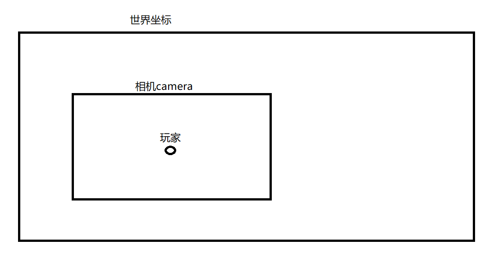

# libgdx

## 2D

### 移动

移动 = 时间 * 速度

```java
x += speed * delta
```

create():

```java
player.setSize(100, 100);
playerX = 100;
playerY = 100;
```

render():

时间：

```java
float delta = Gdx.graphics.getDeltaTime();
if (Gdx.input.isKeyPressed(Input.Keys.W)) {
    playerY += playerSpeed * delta;
}
```

防止玩家越界：

```java
playerY = MathUtils.clamp(playerY, 0, Gdx.graphics.getHeight() - 100);
```

```java
player.setPosition(playerX, playerY);
```

### 转向

鼠标坐标 - 玩家中心坐标 = 玩家到鼠标的距离，通过atan2计算弧度*MathUtils.radiansToDegrees得到角度

最终setRotation(playerAngle)

获取鼠标x,y坐标：

- 注意：libgdx中的坐标系与windows的坐标系相反 所以y轴需要 高度 - 鼠标y轴 = 实际鼠标y轴

```java
// 鼠标在游戏中的坐标
float mouseX = Gdx.input.getX();
float mouseY = Gdx.graphics.getHeight() - Gdx.input.getY();
```

计算玩家中心：

```java
// 玩家中心
float playerCenterX = playerX + player.getWidth() / 2f;
float playerCenterY = playerY + player.getHeight() / 2f;
```

计算玩家到鼠标的距离：

```java
float dx = mouseX - playerCenterX;
float dy = mouseY - playerCenterY;
```

计算角度：

```java
playerAngle = MathUtils.atan2(dy, dx) * MathUtils.radiansToDegrees;
```

atan2=dy/dx(弧度)*57.2 = 角度

```java
player.setRotation(playerAngle);
```

### 子弹

查看转向，需要通过计算的鼠标距离来完成计算子弹移动

公式：

玩家到鼠标坐标距离的2次方相加 = 根号结果 = 玩家到鼠标的斜边长度

玩家到鼠标距离坐标 / 斜边长度 = 子弹方向

子弹移动 = 子弹方向 * 子弹速度 * 时间

```java
bullet.x += bullet.dirX * bulletSpeed * delta;
bullet.y += bullet.dirY * bulletSpeed * delta;
```


```java
private float jg = 0.0f; // 子弹发射间隔
private float cz = 0.1f; // 重置发射时间
```

```java
jg -= delta;
if (Gdx.input.isButtonPressed(Input.Buttons.LEFT) && jg <= 0.0f) {
    float length = (float) Math.sqrt(dx * dx + dy * dy);
    if (length > 0.001f) {
        float dirX = dx / length;
        float dirY = dy / length;
        bullets.add(new Bullet(playerCenterX - 5, playerCenterY - 5, dirX, dirY, 10, 10));
        jg = cz;
    }
}
```

### 绘制血条


```java
// 血条总长度
float barWidth = width;
float barHeight = 5;

// 血条位置：玩家上方 10 像素
float barX = x;
float barY = y + height + 10;

// 背景
shape.setColor(1, 0, 0, 1);
shape.rect(
    barX,
    barY,
    barWidth,
    barHeight
);

// 当前血量比例
float hpPercent = hp / 100f;

// 当前血量
shape.setColor(0, 1, 0, 1);
shape.rect(
    barX,
    barY,
    barWidth * hpPercent,
    barHeight
);
```

shapeRenderer 要单独绘制

```java
shapeRenderer.begin(ShapeRenderer.ShapeType.Filled);
player.drawHealthBar(shapeRenderer);
shapeRenderer.end();
```

### 地图-防止越界

当添加地图瓦片时，如果地图大于窗口边缘，当物体移动时会检测到碰撞为窗口边缘那么物体不能移动到瓦片边缘

公式：width = 数组宽 * 瓦片大小。height = 数组高 * 瓦片大小

代码：

地图

```java
private final TileType[][] map = {
        {WALL, WALL, WALL, WALL, WALL, WALL, WALL, WALL, WALL, WALL, WALL, WALL, WALL, WALL, WALL},
        {WALL, GROUND, GROUND, GROUND, GROUND, GROUND, GROUND, GROUND, GROUND, GROUND, GROUND, GROUND, GROUND, GROUND, WALL},
        {WALL, GROUND, GROUND, GROUND, GROUND, GROUND, GROUND, GROUND, GROUND, GROUND, GROUND, GROUND, GROUND, GROUND, WALL},
        {WALL, GROUND, GROUND, GROUND, GROUND, GROUND, GROUND, GROUND, GROUND, GROUND, GROUND, TREE, GROUND, GROUND, WALL},
        {WALL, GROUND, GROUND, GROUND, WALL, WALL, GROUND, GROUND, TREE, TREE, GROUND, GROUND, GROUND, GROUND, WALL},
        {WALL, GROUND, GROUND, GROUND, GROUND, GROUND, GROUND, GROUND, GROUND, GROUND, GROUND, GROUND, GROUND, GROUND, WALL},
        {WALL, GROUND, GROUND, GROUND, GROUND, GROUND, GROUND, GROUND, GROUND, GROUND, GROUND, GROUND, GROUND, GROUND, WALL},
        {WALL, WALL, WALL, WALL, WALL, WALL, WALL, WALL, WALL, WALL, WALL, WALL, WALL, WALL, WALL}
    }
```

处理

```
// 计算地图边界
float mapHeight = map.length * tileSize;
float mapWidth = map[0].length * tileSize;
// 玩家移动
player.removeX(delta, mapWidth);
player.removeY(delta, mapHeight);
// 实现方法
public void removeX(float delta, float width) {
    if (Gdx.input.isKeyPressed(Input.Keys.A)) {
        x -= speed * delta;
    }
    if (Gdx.input.isKeyPressed(Input.Keys.D)) {
        x += speed * delta;
    }
    x = MathUtils.clamp(x, 0, width - this.width);
}

public void removeY(float delta, float height) {
    if (Gdx.input.isKeyPressed(Input.Keys.W)) {
        y += speed * delta;
    }
    if (Gdx.input.isKeyPressed(Input.Keys.S)) {
        y -= speed * delta;
    }
    y = MathUtils.clamp(y, 0, height - this.height);
}
```

### 相机坐标

需要理解，世界坐标，相机坐标(camera)，屏幕坐标, 鼠标坐标



```java
// 成员变量
private OrthographicCamera camera;
// 初始化
camera = new OrthographicCamera();
camera.setToOrtho(
    false,
    wi,
    hi
);
camera.update();
// resize实施绘制窗口
camera.setToOrtho(
    false,
    width,
    height
);
camera.update();
// 相机跟随玩家移动并且防止超越边界
// 地图大小
float mapWidth = map[0].length * tileSize;
float mapHeight = map.length * tileSize;
// 相机中心
float cameraHalfWidth = camera.viewportWidth / 2f;
float cameraHalfHeight = camera.viewportHeight / 2f;
// 玩家中心
float cameraX = player.getX() + player.getWidth() / 2f;
float cameraY = player.getY() + player.getHeight() / 2f;
// 限制相机边界
cameraX = Math.max(cameraHalfWidth,
    Math.min(cameraX, mapWidth - cameraHalfWidth));
cameraY = Math.max(cameraHalfHeight,
    Math.min(cameraY, mapHeight - cameraHalfHeight));
// 相机跟随玩家
camera.position.set(
    cameraX, cameraY, 0
);
camera.update();
batch.setProjectionMatrix(camera.combined);
shapeRenderer.setProjectionMatrix(camera.combined);
```

问题：

> 此时鼠标坐标对应了屏幕坐标而不是相机坐标会出现鼠标坐标错误的问题
> 解决思路：将鼠标坐标转换为世界坐标

```java
Gdx.input.getX()
Gdx.input.getY()
```

这个代码得到的是屏幕坐标，但是玩家，敌人，地图现在都是 世界坐标
所以相机移动以后：

```text
鼠标
 ↓
屏幕坐标
 ↓
转换
 ↓
世界坐标
 ↓
玩家 → 鼠标方向
```

libgdx已经帮我们提供了转换方法：

`camera.unproject()` 


```java
Vector3 mouse = new Vector3(
    Gdx.input.getX(),
    Gdx.input.getY(),
    0
);
camera.unproject(mouse);
```

注意：子弹逻辑如果出现问题可能需要更改判定越界逻辑，改为边界为地图大小
