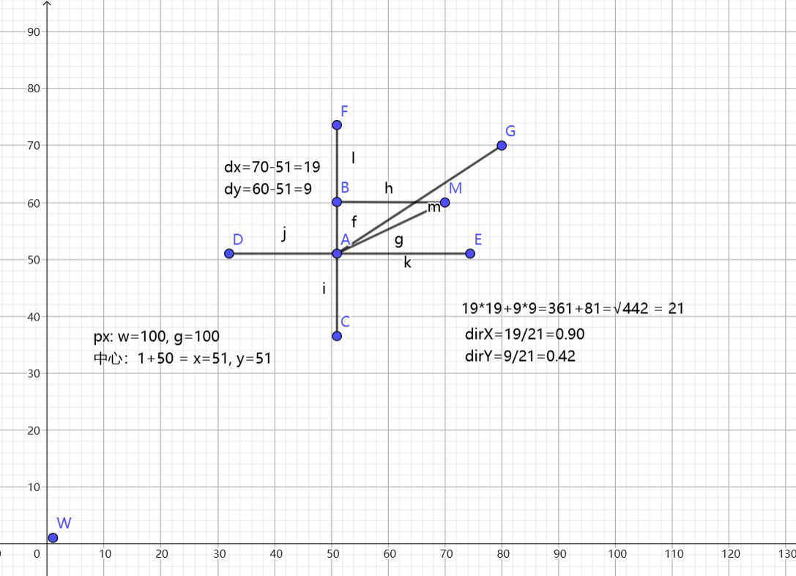

# libgdx

## 2D

### 移动

移动 = 时间 * 速度

```java
x += speed * delta
```

create():

```java
player.setSize(100, 100);
playerX = 100;
playerY = 100;
```

render():

时间：

```java
float delta = Gdx.graphics.getDeltaTime();
if (Gdx.input.isKeyPressed(Input.Keys.W)) {
    playerY += playerSpeed * delta;
}
```

防止玩家越界：

```java
playerY = MathUtils.clamp(playerY, 0, Gdx.graphics.getHeight() - 100);
```

```java
player.setPosition(playerX, playerY);
```

### 转向

鼠标坐标 - 玩家中心坐标 = 玩家到鼠标的距离，通过atan2计算弧度*MathUtils.radiansToDegrees得到角度

最终setRotation(playerAngle)

获取鼠标x,y坐标：

- 注意：libgdx中的坐标系与windows的坐标系相反 所以y轴需要 高度 - 鼠标y轴 = 实际鼠标y轴

```java
// 鼠标在游戏中的坐标
float mouseX = Gdx.input.getX();
float mouseY = Gdx.graphics.getHeight() - Gdx.input.getY();
```

计算玩家中心：

```java
// 玩家中心
float playerCenterX = playerX + player.getWidth() / 2f;
float playerCenterY = playerY + player.getHeight() / 2f;
```

计算玩家到鼠标的距离：

```java
float dx = mouseX - playerCenterX;
float dy = mouseY - playerCenterY;
```

计算角度：

```java
playerAngle = MathUtils.atan2(dy, dx) * MathUtils.radiansToDegrees;
```

atan2=dy/dx(弧度)*57.2 = 角度

```java
player.setRotation(playerAngle);
```

### 子弹

查看转向，需要通过计算的鼠标距离来完成计算子弹移动

公式：

玩家到鼠标坐标距离的2次方相加 = 根号结果 = 玩家到鼠标的斜边长度

玩家到鼠标距离坐标 / 斜边长度 = 子弹方向

子弹移动 = 子弹方向 * 子弹速度 * 时间

```java
bullet.x += bullet.dirX * bulletSpeed * delta;
bullet.y += bullet.dirY * bulletSpeed * delta;
```



```java
private float jg = 0.0f; // 子弹发射间隔
private float cz = 0.1f; // 重置发射时间
```

```java
jg -= delta;
if (Gdx.input.isButtonPressed(Input.Buttons.LEFT) && jg <= 0.0f) {
    float length = (float) Math.sqrt(dx * dx + dy * dy);
    if (length > 0.001f) {
        float dirX = dx / length;
        float dirY = dy / length;
        bullets.add(new Bullet(playerCenterX - 5, playerCenterY - 5, dirX, dirY, 10, 10));
        jg = cz;
    }
}
```

